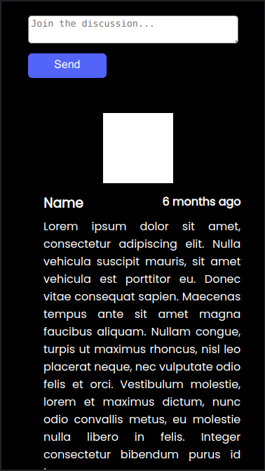

# ManhwaLab

Manhwalab is a community page, and a modern library for people with great interest in the culture of Japanese mangas, Korean manhwas, and Chinese manhuas. 
Manage your readings and wishlists with us, and find your next comic to read here via our recommendation system.
Also, check out the most popular stuff, and immerse yourself in the statistics and useful information provided by us.

## Design

### Mobile Verical View:

 





### Mobile Horizontal View:


### Desktop View:


## Setup / Installation:

### Frontend:

1. If you do not have npm installed, then run the following command:

```bash
npm install -g npm
```

2. Run the follwoing to get the dependencies:

```bash
npm install
```

### Backend:

1. If you do not have java installed, then run the following command:

```bash
sudo apt install default-jdk
```

2. If you do not have maven installed, then run the following commands:

```bash
 wget https://mirrors.estointernet.in/apache/maven/maven-3/3.6.3/binaries/apache-maven-3.6.3-bin.tar.gz
```
```bash
 tar -xvf apache-maven-3.6.3-bin.tar.gz
```
```bash
 mv apache-maven-3.6.3 /opt/
```

3. Add the following lines to the user profile file (.profile):

    M2_HOME='/opt/apache-maven-3.6.3'
    PATH="$M2_HOME/bin:$PATH"
    export PATH

## Usage:

### Frontend: 

Go to the frontend directory:

```bash
cd frontend
```

#### Developer Mode:

Use the following command:

```bash
npm run serve
```

#### Production Mode:

1. If you do not have serve installed, run the following command:

```bash
npm install -g serve
```

2. Use the following command to serve the build:

```bash
serve -s build -l 8081
```

### Backend: 

Run the start.sh script in the backend directory:

```bash
cd backend
```

```bash
./start.sh
```

## Features:

### Pages:

- Home Page
- Login Modal
- Registration Modal
- Browsing Page
- User Profile Page
- Comic Profile Page

### You can:
- Login and register with JWT authentication
- Check out the most popular comics of the day, week, and month
- Check out the top rated, and top ongoing comics
- Find your new comic to read with browsing and filtering
- Search for a comic via its title
- Find out more about your comics by viewing its profile page
- Manage you comics by putting them in your 'currently reading', 'want to read', 'already read', and 'favourites' lists
- Build and manage your profile with CRUD operations

### In Progress:
- Commenting
- Comic Recommendations
- Comic Rating

## Technologies:

### Backend:
- Java Spring
- Docker
- PSQL

### Frontend:
- Vue
- Pinia

### Deployment:
- AWS

## Our Team:

We are a small group of two young and new developers:

- Áron Bodzás - Backend
- László Lehoczki - Frontend